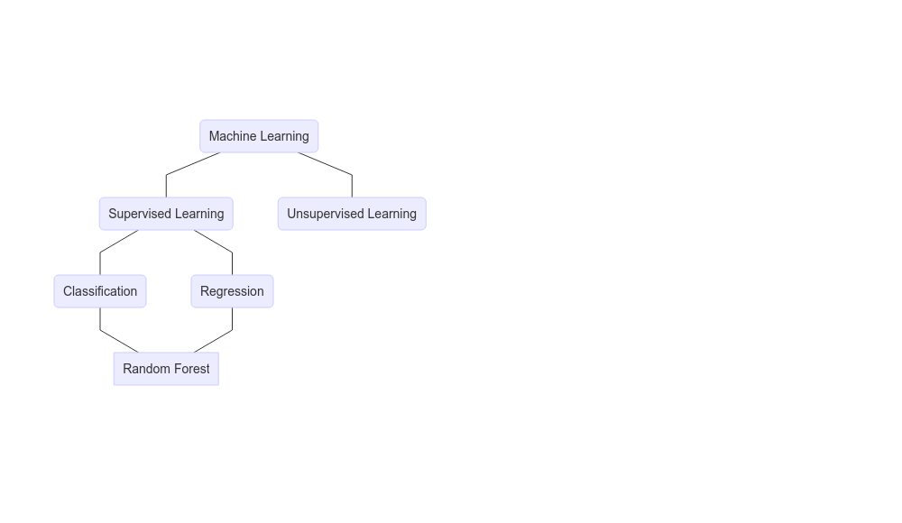

## Summary

1. <b> History of SVM </b>
2. Types Of Machine Learning
3. Why support vector machine ?
4. What is support vector machine ?
5. How does it work ?    
  a. Hard Margin    
  b. Soft Margin
  c. Kernel trick    
6. SVM in practice - Implementing biological application with Python    
  a. Use Case - Problem Statement    
  b. Use Case - Translocation Activity

---

## History of SVM

1. 1963: Linear classifier - Maximal Margin Classifier by Vapnik and 	Chervonenkis.
2. 1992: Nonlinear classification – Kernel trick by Bernhard E. Boser.
3. 1995: The Soft Margin Classifier by Corinna Cortes and Vapnik.

---

## Types of Machine Learning

---

## Why support vector machine ?

* It works really well with clear margin of separation.
* It is effective in high dimensional spaces.
* Robust against the outliers (controlled with the parameter C).

---

## What is support vector machine ?

Support vector machines (SVMs) aim to find a decision hyperplane that separates data points of different classes with a maximal margin.

---

## How does it work ?
We are given a set of people with different:
  
Height | Weight | Sex
------ | ------ | ----
145    | 55     | Woman
155    | 50     | Woman
160    | 52     | Woman
158    | 68     | Woman
174    | 74     | Man
170    | 86     | Man
180    | 62     | Man
185    | 78     | Man

---

## How does it work ?

---

## How does it work ?
### Hard Margin
To separate the two classes we should split the data in the best possible way.

---

## How does it work ?
### Hard Margin

---&twocol

## How does it work ?
### Hard Margin

Prediction

*** =left

*** =right

---

## Summary

1. History of SVM
2. Types Of Machine Learning
3. Why support vector machine ?
4. What is support vector machine ?
5. <b> How does it work ? </b>    
  a. Hard Margin    
  b. <b> Soft Margin </b>    
  c. Kernel trick    
6. SVM in practice - Implementing biological application with Python    
  a. Use Case - Problem Statement    
  b. Use Case - Translocation Activity

---

## How does it work ?
### Soft Margin

---

## How does it work ?
### Soft Margin

---

## Summary

1. History of SVM
2. Type Of Machine Learning
3. Why support vector machine ?
4. What is support vector machine ?
5. <b> How does it work ? </b>    
  a. Hard Margin    
  b. Soft Margin    
  c. <b> Kernel trick </b>   
6. SVM in practice - Implementing biological application with Python    
  a. Use Case - Problem Statement    
  b. Use Case - Translocation Activity

---

## How does it work ?
### Kernel trick

How to perform SVM for this type of dataset ?

---

## How does it work ?
### Kernel trick

---

## Summary

1. History of SVM
2. Type Of Machine Learning
3. Why support vector machine ?
4. What is support vector machine ?
5. How does it work ?    
  a. Hard Margin    
  b. Soft Margin    
  c. Kernel trick    
6. <b> SVM in practice - Implementing biological application with Python </b>    
  a. <b> Use Case - Problem Statement </b>    
  b. Use Case - Translocation Activity

---

## SVM in practice - Implementing biological application with Python
### Use Case - Problem Statement
Estimate the lowest dose necessary to induce the cytoplasm to nucleus translocation of the 
FKHR-EGFP in U2OS (osteosarcoma cell line). Channel 1 = FKHR-GFP; Channel 2 = DNA

---

## SVM in practice - Implementing biological application with Python
### Use Case - Translocation Activity

---

### Use Case - Translocation Activity
      
$$
$$
$Accuracy = (\frac{Count True}{Count Total})*100$
$$
$$
$Error Rate = (\frac{Count False}{Count Total})*100$
$$
$$
$Error Rate = 1 - Accuracy$

---
  

### Use Case - Translocation Activity

---

## Summary

1. <b> History of Random Forest </b>
2. Types Of Machine Learning
3. Why Random Forest ?
4. What is Random Forest ?
5. Decision Tree
6. How Does a decision tree work ?
7. How Does a random forest work ?
8. RF in practice - Implementing biological application with Python    
  a. Use Case - Problem Statement    
  b. Use Case - Translocation Activity
9. Machine Learning in Bioimage analysis

---

## History of Random Forest

1. 1997: In an important paper on written character recognition, Amit and Geman define a large number of geometric features and search over a random selection of these for the best split at each node.
2. 1998: Ho has written a number of papers on "the random subspace" method which does a random selection of a subset of features to use to grow each tree.
3. 2001: The introduction of random forests proper was first made in a paper by Leo Breiman. This paper describes a method of building a forest of uncorrelated trees using a CART like procedure, combined with randomized node optimization and bagging.

---

## Types of Machine Learning

---

## Why Random Forest ?
<b>No Overfitting</b>:    
* Number of trees increase
* Training time is less   

<b>High Accuracy</b>:
* Run efficiently on large database

<b>Missing data</b>:
* Accuracy when large proportion of data is missing

---

## What is Random Forest ?

 Random Forest creates multiple Decision Trees during training phase.    
The Decision of the majority of the trees is chosen by the random forest as the final decision. 

---

## Summary

1. History of Random Forest
2. Types Of Machine Learning
3. Why Random Forest ?
4. What is Random Forest ?
5. <b> Decision Tree </b>
6. How Does a decision tree work ?
7. How Does a random forest work ?
8. RF in practice - Implementing biological application with Python    
  a. Use Case - Problem Statement    
  b. Use Case - Translocation Activity
9. Machine Learning in Bioimage analysis

---

## Decision Tree

Decision Tree is a tree shaped diagram. Each branch of the tree is an action 
and each node as a result of the decision taken.

---

## Decision Tree

---

## Decision Tree

---

## Decision Tree

---

## Decision Tree
### Calculate entropy

$$Entropy = -\sum P(X)logp(X) $$ where p(x) is a fraction of a given class

$$ P_{lemon} = \frac{3}6 = 0.5$$
$$ P_{apple} = \frac{3}6 = 0.5$$
$$ E_1 = - \sum P_{lemon}log_2(P_{lemon}) + P_{apple}log_2(P_{apple}) $$
$$ E_1 = - (-0.5 + (-0.5)) = 1$$

---

## Decision Tree
### Calculate entropy

$$ P_{lemon} = \frac{1}3 = 0.334$$
$$ P_{apple} = \frac{2}3 = 0.667$$
$$E_{left} = - (0.334 log_2(0.334) + 0.667 log_2(0.667)) = -(-0.52+ (-0.38)) = 0.9$$
$$E_{right} = - (0.334 log_2(0.334) + 0.667 log_2(0.667)) = -(-0.52+ (-0.38)) = 0.9$$

$$E_2 = \frac{n classes in left child node}{n total classes in parent node}*E_{left} + \frac{n classes in right child node}{n total classes in parent node}*E_{right}$$
$$E_2 = \frac{3}6 * 0.9 + \frac{3}6 * 0.9 = 0.9$$

---

## Decision Tree

---

## Decision Tree

---

## Decision Tree
### Information Gain

$$Informationgain = E_{parent} - [weightes average] * E_{children}$$
$$Information gain = E_1 - E_2 = 1-0.9 = 0.10$$

---

## Decision Tree

---

## Decision Tree

---

## How Does a decision tree work ?

---

## How Does a decision tree work ?

---

## How Does a decision tree work ?

---

## How Does a decision tree work ?

---

## How Does a decision tree work ?

---

## How Does a decision tree work ?

---

## Summary

1. History of Random Forest
2. Types Of Machine Learning
3. Why Random Forest ?
4. What is Random Forest ?
5. Decision Tree
6. How Does a decision tree work ?
7. <b> How Does a random forest work ? </b>
8. RF in practice - Implementing biological application with Python    
  a. Use Case - Problem Statement    
  b. Use Case - Translocation Activity
9. Machine Learning in Bioimage analysis

---

## How Does a random forest work ?

---

## How Does a random forest work ?

---

## How Does a random forest work ?

---

## How Does a random forest work ?

---

## How Does a random forest work ?

---

## How Does a random forest work ?

---

## How Does a random forest work ?

---

## Summary

1. History of Random Forest
2. Types Of Machine Learning
3. Why Random Forest ?
4. What is Random Forest ?
5. Decision Tree
6. How Does a decision tree work ?
7. How Does a random forest work ?
8. <b> RF in practice - Implementing biological application with Python </b>    
  a. <b> Use Case - Problem Statement </b>    
  b. Use Case - Translocation Activity
9. Machine Learning in Bioimage analysis

---

## RF in practice - Implementing biological application with Python
### Use Case - Problem Statement
Estimate the lowest dose necessary to induce the cytoplasm to nucleus translocation of the 
FKHR-EGFP in U2OS (osteosarcoma cell line). Channel 1 = FKHR-GFP; Channel 2 = DNA

---

## RF in practice - Implementing biological application with Python
### Use Case - Translocation Activity

---

## Machine Learning in Bioimage analysis

---

## Machine Learning in Bioimage analysis

---

## Machine Learning in Bioimage analysis

