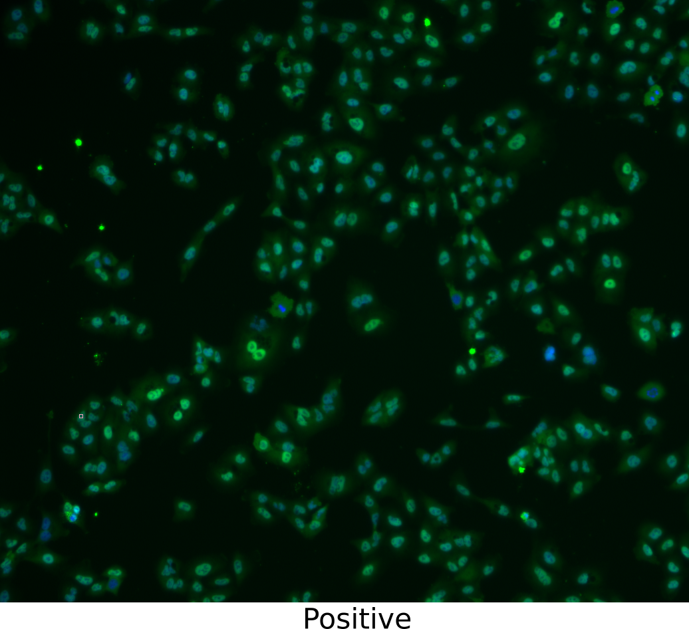
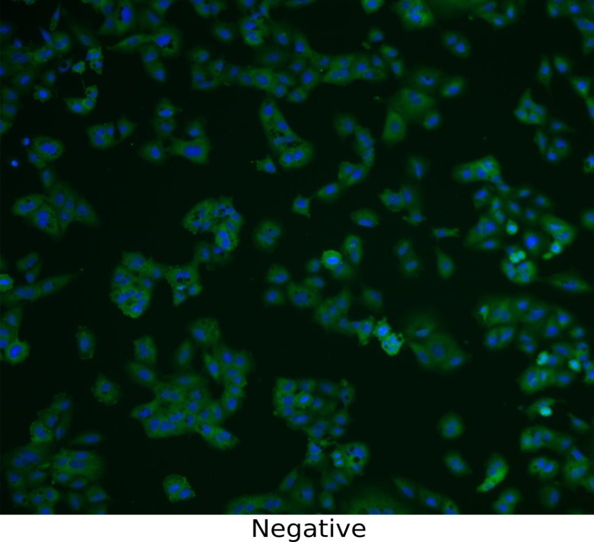
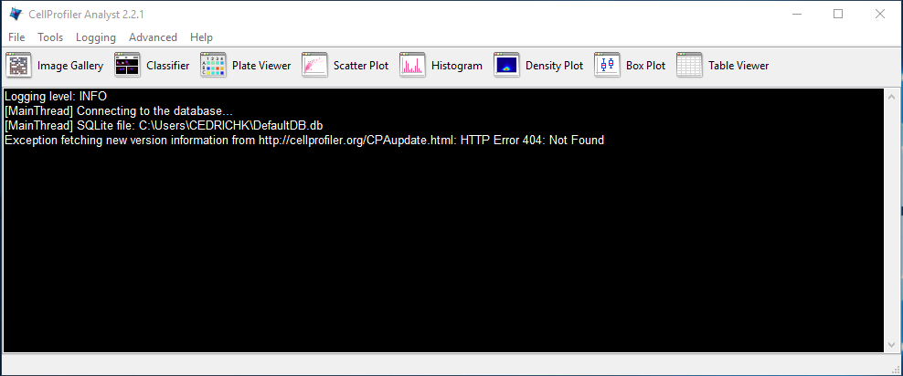
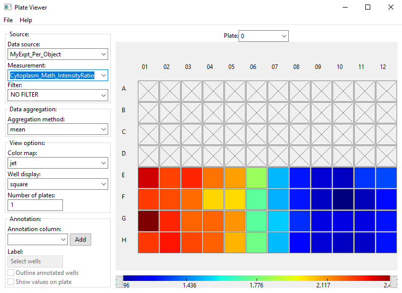
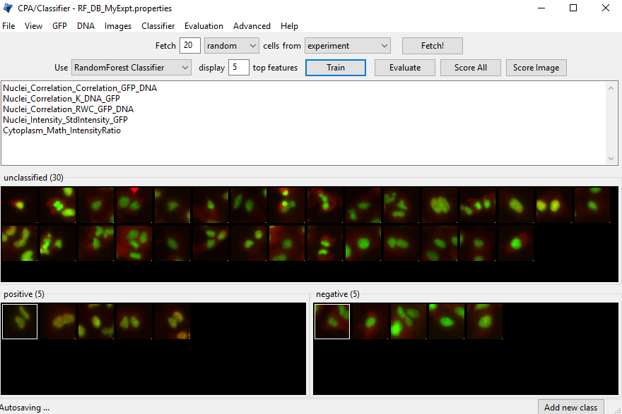
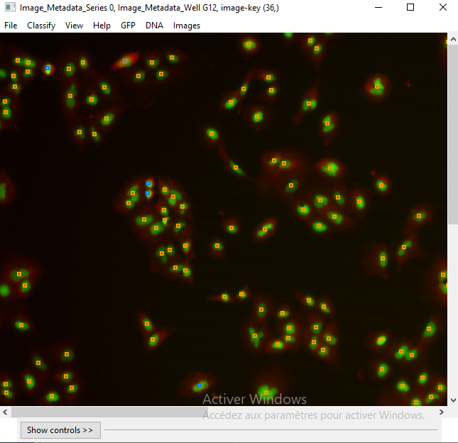

```{r setup, include=FALSE}
knitr::opts_chunk$set(echo = TRUE)
```

## Biological application
We consider a half plate map (E-H) with of the  images of *cytoplasm to nucleus translocation* of the transcription factor NFkB in A549 (human alveolar basal epithelial) cells in response to *TNFa concentration*.    
For each well there is one field with two images: a *nuclear counterstain (DAPI)* image and a *signal stain (FITC)* image. Image size is 1360 x 1024 pixels. Images are in *8-bit BMP* format. 


```{r 2figs, results='asis', echo=FALSE, fig.width=3, fig.height=3, out.width='0.49\\linewidth'}



#t1 <- head(mtcars)[1:3]
#t2 <- head(mtcars)[4:6]
#knitr::kable(list(t1, t2))
#cat("\\pagebreak")
```

## Goals of exercise
In this exercise, we aim to: (1) determine this lowest possible *dose* necessary to observe this effect, and (2) to optimize the analysis of images in which *NFkB is cytoplasmic versus nuclear*, in order to separate positive controls and negative controls as best as possible.

## Materials
You will work with only 48 images. These images are located into /exercises/rf/cp/images. The plate map is a standard 96-well plate, containing 12 concentration points in columns and 4 replica rows. In addition to these images, a text file called “dose.csv” is provided, containing information about where on the 96-well plate the wells were located, and how the cells were treated. This file is located into /exercises/rf/cp/metadata.

## Exercise: Using the CellProfiler software to identify features and obtain measurements from cellular images

a) Start CellProfiler and Open Project... name *translocation_activity.cpproj*.

b) By clicking on the module *Images*, you can select your images or folders containing the files.

c) Click on the module *Metadata*; this module allows you to extract information from your images or external file. Change the path next to the Sub-folder to select the dose.csv file.

d) Your pipeline is now ready to run analysis over all your 48 images.

## Exercise: Using the CellProfiler Analyst software to visualize the data and classify cells

### Starting CellProfiler Analyst and loaded the properties file

a) Start CellProfiler Analyst (Figure 1) and open the properties file, *RF_DB_MyExpt* created by the *ExportToDatabase* module in CP pipeline.
    


### Visualizing the measurements in a 96-well plate layout view

a) Click-on *Plate Viewer* (Figure 2) to display a 96-well plate with the feature values for each well. Only 48 out of the 96 wells have data associated with them.    

b) You can visualize the data per object with *MyExpt_Per_Object* and you can display the ratio of GFP in Nuclei to GFP in Cytoplasm calculated previously by selecting *Cytoplasm_Math_IntensityRatio* under Measurement.    
    
    >Do we have homogeneous values or heterogeneous values for this measure?    
    If heterogeneous what are the wells that have the lowest values?

c) In this step, you will see under “Well display” the image thumbnails.

    >Do you have an idea of the wells that have mostly a positive cell phenotype?



### Use the Classifier to recognize phenotypes

a) Click-on the *Classifier* (Figure 3) to start the machine-learning classification tool. In this case, we will “train” the classifier to recognize cells in which NFkb is located exclusively in the nucleus (“positives”) versus outside the nucleus (“negatives”) by sorting examples of each into bins.

b) Click on the *Fetch!* button to display randomly pictures from this experiment.

c) "Drag & drop” which ever cells you consider clearly positive into the “positive” bin. A small dot is displayed in the thumbnail that show which object will be used for classification.

    > Get at least 5 cells in the positive bin and 5 cells in the negative bin and click on the *Train* button.

### Reviewing the rules that determine positives and negatives cells

a) By default, it displays the top 5 of the features.

    > Write the top 5 features. Do you think that displayed features are the most relevant to distinguish classes ? For example, feature "ImageNumber" is less relevant than "Nuclei_Math_IntensityRatio".

If you do not have interressing features, you can add images in each bin and start the training again.



### Reviewing the accuracy of the classification with the confusion matrix

a) Press the *Evaluate* button to generate a confusion matrix for the cells you’ve classified so far.

      > How accurate is your classification after adding only a few cells to your training set?    
      What is the percentage of accuracy ? Note it !

### Refining the training set by sorting more “unclassified” cells into the “positive” and “negative” bins

a) If you find that the classifier is not well-trained, you need to either add more cells to the training set, or obtain more measurements from the cells.

### Refining the training set by obtaining samples from positive and negative control wells

a) Open the *Plate Viewer* and open an image from the negative controls. Click on a cell in the image that is negative for the phenotype and drag-and-drop it into the negative bin.   
Repeat the above for a well containing a positive control sample, dropping the cells into the positive bin. Click the *Train* button.

b) Repeat the steps above to obtain more accuracy.

### Refining the training set by correcting misclassified cells in an image

a) Double-click any of cell thumbnails in the positive or negative bins.
  From the image that opens click on *Classify Image* (Figure 4). 
  
b) Look for up to 5 cells that are clearly misclassified. For each of these cells that you find, click on it and drag-and-drop it into the appropriate bin, then click on *Train* button again

c) Evaluate your model.



### Refining the training set by fetching positive and negative cells

a) you can now request that the computer fetchs more examples of positive and negative cells. These new sample cells can be added to the corresponding bins, in order to improve the classifier’s performance.

b) Repeat this step until you have at least 20 cells in each bin.

    > Has the accuracy of the model increased ? No, Go back to the first step and repeat, until the classifier displays the desired level of accuracy.

### Classifying all cells in the experiment

a) Once the classifier is of the desired accuracy, it is ready to be applied to the complete image data set. Press the *Score All* button. Every cell in every image will now be scored as positive or negative by the classifier you built. A “Hit table” window will appear containing the summarized scores for every image. The "Total Cell Count" is reported, as well as the number of positive and negative cells classified. The last column is the enrichment score.

    > Which wells have a very high enrichment score? What is the minimum concentration that generate the expected effect?    
    