```{r setup, include=FALSE}
options(htmltools.dir.version = FALSE)

theme_custom <- function(base_size = 14) {
  theme_bw(base_size = base_size) %+replace%
    theme(
      # L'ensemble de la figure
      plot.title = element_text(size = rel(1), face = "bold", margin = margin(0,0,5,0), hjust = 0),
      # Zone où se situe le graphique
      panel.grid.minor = element_blank(),
      panel.border = element_blank(),
      # Les axes
      axis.title = element_text(size = rel(0.85), face = "bold"),
      axis.text = element_text(size = rel(0.70), face = "bold"),
      axis.line = element_line(color = "black", arrow = arrow(length = unit(0.3, "lines"), type = "closed")),
      # La légende
      legend.title = element_text(size = rel(0.85), face = "bold"),
      legend.text = element_text(size = rel(0.70), face = "bold"),
      legend.key = element_rect(fill = "transparent", colour = NA),
      legend.key.size = unit(1.5, "lines"),
      legend.background = element_rect(fill = "transparent", colour = NA),
      # Les étiquettes dans le cas d'un facetting
      strip.background = element_rect(fill = "#17252D", color = "#17252D"),
      strip.text = element_text(size = rel(0.85), face = "bold", color = "white", margin = margin(5,0,5,0))
    )
}

```

# Summary

1. History of SVM

2. Types Of Machine Learning

3. Why support vector machine ?

4. What is support vector machine ?

5. How does it work ?   
  a. Hard Margin  
  b. Soft Margin  
  c. Kernel trick

6. Evaluating model performance

7. Improving model performance

8. SVM in practice - Implementing biological application with Python  
  a. Use Case - Problem Statement  
  b. Use Case - Translocation Activity
---

#1. History Of SVM

1. *1963*: Linear classifier - <u>Maximal Margin</u> Classifier by Vapnik and Chervonenkis.

--

1. *1992*: Nonlinear classification – <u>Kernel</u> trick by Bernhard E. Boser.

--

1. *1995*: The <u>Soft Margin</u> Classifier by Corinna Cortes and Vapnik.

---

#2. Types of Machine Learning

```{r, echo=FALSE, warning=FALSE, message=FALSE, out.width = "100%"}
library(DiagrammeR)
#library(webshot)

#webshot::install_phantomjs()
DiagrammeR::mermaid("
  graph TD
  A{<b>Machine Learning</b>} --> B{<b>Supervised Learning</b>}
  A --> C(<b>Unsupervised Learning</b>)
  A --> D(<b>Reinforcement Learning</b>)
  B --> E[<b>Classification</b>]
  B --> F[<b>Regression</b>]
  E --> G(<b>SVM</b>)
  F --> G
  style A fill:#E5E25F
  style B fill:#E5E25F
  style C fill:#87AB51
  style D fill:#87AB51
  style G fill:#87AB51
  style E fill:#B6E6E6
  style F fill:#B6E6E6
")
```

---

#3. Why support vector machine ?

* It works really well with clear margin of separation.   

* It is effective in high dimensional spaces.   

* Robust against the outliers (controlled with the parameter C).

---

#4. What is support vector machine ?

Support vector machines (SVMs) aim to find a decision **hyperplane** that separates data points of
different classes with a **maximal margin**.


<!-- # What is support vector machine ? -->
<!-- ### a. Mathematics behind Maximum margin -->

<!-- $$w_0 + w^Tx_{pos} = 1$$ -->
<!-- $$w_0 + w^Tx_{neg} = -1$$ -->
<!-- $$=> w^T(x_{pos} - x_{neg}) = 2$$ -->
<!-- $$||w|| = \sqrt{\sum_{j-1}^{m}{w_j^2}}$$ -->
<!-- $$\frac{w^T(x_{pos} - x_{neg})}{||w||} = \frac{2}{||w||}$$ -->
<!-- $$min\frac{1}{2}||w||^2\\S.t. y_i(w_0 + w^Tx_i) \ge 1\ ∀_i$$ -->
---

#5. How does it work ?

We are given a set of people with different:
  
Height | Weight | Sex
------ | ------ | ----
145    | 55     | Woman
155    | 50     | Woman
160    | 52     | Woman
158    | 68     | Woman
174    | 74     | Man
170    | 86     | Man
180    | 62     | Man
185    | 78     | Man

---

#5. How does it work ?

```{r svm1, echo=FALSE, warning=FALSE, message=FALSE, fig.asp = 0.8, fig.width = 7, out.width="70%", dev='svg'}
library(tidyverse)

df <- data.frame(Height = c(145,155,160,158,174,170,180,185),
                 Weight = c(55,50,52,68,74,86,62,78),
                 Sex = c(rep("Woman",4),rep("Man",4)))
df$Sex <- factor(df$Sex)

p <- ggplot(df, aes(y = Weight, x = Height, group = Sex)) + 
  geom_point(aes(color = Sex)) +
  scale_color_manual(values = c("#a50026","#006837"))
p + theme_custom()
```

---

#5. How does it work ?
## a. Hard Margin 

To separate the two classes we should split the data in the best possible way.

```{r svm2, echo=FALSE, warning=FALSE, message=FALSE, out.width="50%", dev='svg'}
library(e1071)

df <- data.frame(Height = c(145,155,160,158,174,170,180,185),
                 Weight = c(55,50,52,68,74,86,62,78),
                 Sex = c(rep("Woman",4),rep("Man",4)))
df$Sex <- factor(df$Sex)

p <- ggplot(df, aes(y = Weight, x = Height, group = Sex)) + 
  geom_point(aes(color = Sex)) +
  scale_color_manual(values = c("#a50026","#006837"))
p + theme_custom()

set.seed(10111)
x = matrix(c(145,155,160,158,174,170,180,185,55,50,52,68,74,86,62,78), 8, 2)
y = rep(c(-1, 1), c(4, 4))
#plot(x, col = y + 3, pch = 19)

dat = data.frame(x, y = as.factor(y))
dat2 = as.data.frame(scale(data.frame(x),center = TRUE, scale = TRUE))
dat3 = data.frame(Height = dat2$X1, Weight = dat2$X2, y = as.factor(y))
svmfit = svm(y ~ Weight+Height, data = dat3, kernel = "linear", cost = 10, scale = FALSE)
plot(svmfit, dat3, symbolPalette = c("#006837","#a50026"), color.palette = terrain.colors)
```

---

#5. How does it work ?
## a. Hard Margin

```{r svm3, echo=FALSE, warning=FALSE, message=FALSE, fig.asp = 0.8, fig.width = 7, out.width="70%", dev='svg'}

library(kernlab)
set.seed(10111)
x = matrix(c(145,155,160,158,174,170,180,185,55,50,52,68,74,86,62,78), 8, 2)
y = rep(c(-1, 1), c(4, 4))

dat = data.frame(x, y = as.factor(y))
dat2 = as.data.frame(scale(data.frame(x),center = TRUE, scale = TRUE))
dat3 = data.frame(Height = dat2$X1, Weight = dat2$X2, y = as.factor(y))
ign <- capture.output({
  svmfit2 <- ksvm(y ~ Weight+Height, data = dat3, kernel = "vanilladot", C = 100)
})
x1 = as.matrix(dat2[,c(1,2)])

make.grid = function(x, n = 75) {
  grange = apply(x, 2, range)
  x1 = seq(from = grange[1,1], to = grange[2,1], length = n)
  x2 = seq(from = grange[1,2], to = grange[2,2], length = n)
  expand.grid(Height = x1, Weight = x2)
}

xgrid = make.grid(x1)

#ygrid = predict(svmfit, xgrid)
ygrid = predict(svmfit2, xgrid)

#beta <- drop(t(svmfit$coefs)%*%x1[svmfit$index,])
w <- drop(t(as.matrix(svmfit2@coef[[1]]))%*%x1[svmfit2@alphaindex[[1]],]*-1)
#beta0 <- svmfit$rho
w0 <- svmfit2@b *-1

plot(xgrid, col = c("#006837","#a50026")[as.numeric(ygrid)], pch = 20, cex = .2)
points(x1, col = c("#006837","#006837","#006837","#006837","#a50026","#a50026","#a50026","#a50026"), pch = 19)
# points(x1[svmfit$index,], col = c("#006837","#a50026"), pch = 5, cex = 2)
# abline(beta0 / beta[2], -beta[1] / beta[2])
# abline((beta0 - 1) / beta[2], -beta[1] / beta[2], lty = 2)
# abline((beta0 + 1) / beta[2], -beta[1] / beta[2], lty = 2)

points(x1[svmfit2@alphaindex[[1]],], col = c("#006837","#a50026"), pch = 5, cex = 2)
abline(w0 / w[2], -w[1] / w[2])
abline((w0 - 1) / w[2], -w[1] / w[2], lty = 2)
abline((w0 + 1) / w[2], -w[1] / w[2], lty = 2)

```

---

#5. How does it work ?
## b. Soft Margin

```{r svm4, echo=FALSE, warning=FALSE, message=FALSE, fig.asp = 0.8, fig.width = 7, out.width="50%", dev='svg'}
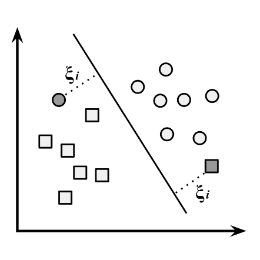
```

---

#5. How does it work ?
## b. Soft Margin

Height | Weight | Sex
------ | ------ | ----
150    | 52     | Man
145    | 55     | Woman
155    | 50     | Woman
160    | 52     | Woman
158    | 68     | Woman
174    | 74     | Man
170    | 86     | Man
180    | 62     | Man
185    | 78     | Man
182    | 70     | Woman

---

#5. How does it work ?
## b. Soft Margin

```{r svm5, echo=FALSE, warning=FALSE, message=FALSE, fig.asp = 0.8, fig.width = 7, out.width="70%", dev='svg'}
library(tidyverse)

df <- data.frame(Height = c(165,145,155,160,158,174,170,180,185,172),
                 Weight = c(52,55,50,52,68,74,86,62,78,70),
                 Sex = c("Man",rep("Woman",4),rep("Man",4),"Woman"))
df$Sex <- factor(df$Sex)

p <- ggplot(df, aes(y = Weight, x = Height, group = Sex)) + 
  geom_point(aes(color = Sex)) +
  scale_color_manual(values = c("#a50026","#006837"))
p + theme_custom()
```

---

#5. How does it work ?
## b. Soft Margin

```{r svm6, echo=FALSE, warning=FALSE, message=FALSE, out.width="50%", dev='svg'}
library(tidyverse)
library(kernlab)

knitr::include_graphics("./figures/ksvm_output.png")
par(mar = c(4, 4, .1, .1))
set.seed(10111)
x = matrix(c(165,145,155,160,158,174,170,180,185,172,52,55,50,52,68,74,86,62,78,70), 10, 2)
y = c(1,rep(c(-1, 1), c(4, 4)),-1)

dat = data.frame(x, y = as.factor(y))
dat2 = as.data.frame(scale(data.frame(x),center = TRUE, scale = TRUE))
dat3 = data.frame(Height = dat2$X1, Weight = dat2$X2, y = as.factor(y))
ign <- capture.output({
  svmfit2 <- ksvm(y ~ Weight+Height, data = dat3, kernel = "vanilladot", C = 100)
})
x1 = as.matrix(dat2[,c(1,2)])

make.grid = function(x, n = 75) {
  grange = apply(x, 2, range)
  x1 = seq(from = grange[1,1], to = grange[2,1], length = n)
  x2 = seq(from = grange[1,2], to = grange[2,2], length = n)
  expand.grid(Height = x1, Weight = x2)
}

xgrid = make.grid(x1)

#ygrid = predict(svmfit, xgrid)
ygrid = predict(svmfit2, xgrid)

#beta <- drop(t(svmfit$coefs)%*%x1[svmfit$index,])
w <- drop(t(as.matrix(svmfit2@coef[[1]]))%*%x1[svmfit2@alphaindex[[1]],]*-1)
#beta0 <- svmfit$rho
w0 <- svmfit2@b *-1

plot(xgrid, col = c("#006837","#a50026")[as.numeric(ygrid)], pch = 20, cex = .2)
points(x1, col = c("#006837","#006837","#006837","#006837","#006837","#a50026","#a50026","#a50026","#a50026","#a50026"), pch = 19)
# points(x1[svmfit$index,], col = c("#006837","#a50026"), pch = 5, cex = 2)
# abline(beta0 / beta[2], -beta[1] / beta[2])
# abline((beta0 - 1) / beta[2], -beta[1] / beta[2], lty = 2)
# abline((beta0 + 1) / beta[2], -beta[1] / beta[2], lty = 2)

points(x1[svmfit2@alphaindex[[1]],], col = c("#a50026","#006837","#006837","#a50026","#006837"), pch = 5, cex = 2)
abline(w0 / w[2], -w[1] / w[2])
abline((w0 - 1) / w[2], -w[1] / w[2], lty = 2)
abline((w0 + 1) / w[2], -w[1] / w[2], lty = 2)

```

---

#5. How does it work ?
## b. Soft Margin


```{r svm7, echo=FALSE, warning=FALSE, message=FALSE, out.width="50%", dev='svg'}
library(tidyverse)
library(kernlab)
par(mar = c(4, 4, .1, .1))
set.seed(10111)
x = matrix(c(165,145,155,160,158,174,170,180,185,172,52,55,50,52,68,74,86,62,78,70), 10, 2)
y = c(1,rep(c(-1, 1), c(4, 4)),-1)

dat = data.frame(x, y = as.factor(y))
dat2 = as.data.frame(scale(data.frame(x),center = TRUE, scale = TRUE))
dat3 = data.frame(Height = dat2$X1, Weight = dat2$X2, y = as.factor(y))
ign <- capture.output({
  svmfit2 <- ksvm(y ~ Weight+Height, data = dat3, kernel = "vanilladot", C = 100)
})
x1 = as.matrix(dat2[,c(1,2)])

make.grid = function(x, n = 75) {
  grange = apply(x, 2, range)
  x1 = seq(from = grange[1,1], to = grange[2,1], length = n)
  x2 = seq(from = grange[1,2], to = grange[2,2], length = n)
  expand.grid(Height = x1, Weight = x2)
}

xgrid = make.grid(x1)

#ygrid = predict(svmfit, xgrid)
ygrid = predict(svmfit2, xgrid)

#beta <- drop(t(svmfit$coefs)%*%x1[svmfit$index,])
w <- drop(t(as.matrix(svmfit2@coef[[1]]))%*%x1[svmfit2@alphaindex[[1]],]*-1)
#beta0 <- svmfit$rho
w0 <- svmfit2@b *-1
par(mar=c(5,5,3,3))
plot(xgrid, col = c("#006837","#a50026")[as.numeric(ygrid)], pch = 20, cex = .2, main = "C = 100")
points(x1, col = c("#006837","#006837","#006837","#006837","#006837","#a50026","#a50026","#a50026","#a50026","#a50026"), pch = 19)
# points(x1[svmfit$index,], col = c("#006837","#a50026"), pch = 5, cex = 2)
# abline(beta0 / beta[2], -beta[1] / beta[2])
# abline((beta0 - 1) / beta[2], -beta[1] / beta[2], lty = 2)
# abline((beta0 + 1) / beta[2], -beta[1] / beta[2], lty = 2)

points(x1[svmfit2@alphaindex[[1]],], col = c("#a50026","#006837","#006837","#a50026","#006837"), pch = 5, cex = 2)
abline(w0 / w[2], -w[1] / w[2])
abline((w0 - 1) / w[2], -w[1] / w[2], lty = 2)
abline((w0 + 1) / w[2], -w[1] / w[2], lty = 2)

############################################################################

ign <- capture.output({
  svmfit2 <- ksvm(y ~ Weight+Height, data = dat3, kernel = "vanilladot", C = 10)
})
x1 = as.matrix(dat2[,c(1,2)])

make.grid = function(x, n = 75) {
  grange = apply(x, 2, range)
  x1 = seq(from = grange[1,1], to = grange[2,1], length = n)
  x2 = seq(from = grange[1,2], to = grange[2,2], length = n)
  expand.grid(Height = x1, Weight = x2)
}

xgrid = make.grid(x1)

#ygrid = predict(svmfit, xgrid)
ygrid = predict(svmfit2, xgrid)

#beta <- drop(t(svmfit$coefs)%*%x1[svmfit$index,])
w <- drop(t(as.matrix(svmfit2@coef[[1]]))%*%x1[svmfit2@alphaindex[[1]],]*-1)
#beta0 <- svmfit$rho
w0 <- svmfit2@b *-1
par(mar=c(5,5,3,3))
plot(xgrid, col = c("#006837","#a50026")[as.numeric(ygrid)], pch = 20, cex = .2, main = "C = 10")
points(x1, col = c("#006837","#006837","#006837","#006837","#006837","#a50026","#a50026","#a50026","#a50026","#a50026"), pch = 19)
# points(x1[svmfit$index,], col = c("#006837","#a50026"), pch = 5, cex = 2)
# abline(beta0 / beta[2], -beta[1] / beta[2])
# abline((beta0 - 1) / beta[2], -beta[1] / beta[2], lty = 2)
# abline((beta0 + 1) / beta[2], -beta[1] / beta[2], lty = 2)

points(x1[svmfit2@alphaindex[[1]],], col = c("#a50026","#006837","#006837","#a50026","#006837"), pch = 5, cex = 2)
abline(w0 / w[2], -w[1] / w[2])
abline((w0 - 1) / w[2], -w[1] / w[2], lty = 2)
abline((w0 + 1) / w[2], -w[1] / w[2], lty = 2)

```

---

#5. How does it work ?
## b. Soft Margin

```{r svm8, echo=FALSE, warning=FALSE, message=FALSE, out.width="50%", dev='svg'}
library(tidyverse)
library(kernlab)
par(mar = c(4, 4, .1, .1))
set.seed(10111)
x = matrix(c(165,145,155,160,158,174,170,180,185,172,52,55,50,52,68,74,86,62,78,70), 10, 2)
y = c(1,rep(c(-1, 1), c(4, 4)),-1)

dat = data.frame(x, y = as.factor(y))
dat2 = as.data.frame(scale(data.frame(x),center = TRUE, scale = TRUE))
dat3 = data.frame(Height = dat2$X1, Weight = dat2$X2, y = as.factor(y))
ign <- capture.output({
  svmfit2 <- ksvm(y ~ Weight+Height, data = dat3, kernel = "vanilladot", C = 1)
})
x1 = as.matrix(dat2[,c(1,2)])

make.grid = function(x, n = 75) {
  grange = apply(x, 2, range)
  x1 = seq(from = grange[1,1], to = grange[2,1], length = n)
  x2 = seq(from = grange[1,2], to = grange[2,2], length = n)
  expand.grid(Height = x1, Weight = x2)
}

xgrid = make.grid(x1)

#ygrid = predict(svmfit, xgrid)
ygrid = predict(svmfit2, xgrid)

#beta <- drop(t(svmfit$coefs)%*%x1[svmfit$index,])
w <- drop(t(as.matrix(svmfit2@coef[[1]]))%*%x1[svmfit2@alphaindex[[1]],]*-1)
#beta0 <- svmfit$rho
w0 <- svmfit2@b *-1
par(mar=c(5,5,3,3))
plot(xgrid, col = c("#006837","#a50026")[as.numeric(ygrid)], pch = 20, cex = .2, main = "C = 1")
points(x1, col = c("#006837","#006837","#006837","#006837","#006837","#a50026","#a50026","#a50026","#a50026","#a50026"), pch = 19)
# points(x1[svmfit$index,], col = c("#006837","#a50026"), pch = 5, cex = 2)
# abline(beta0 / beta[2], -beta[1] / beta[2])
# abline((beta0 - 1) / beta[2], -beta[1] / beta[2], lty = 2)
# abline((beta0 + 1) / beta[2], -beta[1] / beta[2], lty = 2)

points(x1[svmfit2@alphaindex[[1]],], col = c("#a50026","#006837","#006837","#a50026","#a50026","#006837"), pch = 5, cex = 2)
abline(w0 / w[2], -w[1] / w[2])
abline((w0 - 1) / w[2], -w[1] / w[2], lty = 2)
abline((w0 + 1) / w[2], -w[1] / w[2], lty = 2)

############################################################################

ign <- capture.output({
  svmfit2 <- ksvm(y ~ Weight+Height, data = dat3, kernel = "vanilladot", C = 0.1)
})
x1 = as.matrix(dat2[,c(1,2)])

make.grid = function(x, n = 75) {
  grange = apply(x, 2, range)
  x1 = seq(from = grange[1,1], to = grange[2,1], length = n)
  x2 = seq(from = grange[1,2], to = grange[2,2], length = n)
  expand.grid(Height = x1, Weight = x2)
}

xgrid = make.grid(x1)

#ygrid = predict(svmfit, xgrid)
ygrid = predict(svmfit2, xgrid)

#beta <- drop(t(svmfit$coefs)%*%x1[svmfit$index,])
w <- drop(t(as.matrix(svmfit2@coef[[1]]))%*%x1[svmfit2@alphaindex[[1]],]*-1)
#beta0 <- svmfit$rho
w0 <- svmfit2@b *-1
par(mar=c(5,5,3,3))
plot(xgrid, col = c("#006837","#a50026")[as.numeric(ygrid)], pch = 20, cex = .2, main = "C = 0.1")
points(x1, col = c("#006837","#006837","#006837","#006837","#006837","#a50026","#a50026","#a50026","#a50026","#a50026"), pch = 19)
# points(x1[svmfit$index,], col = c("#006837","#a50026"), pch = 5, cex = 2)
# abline(beta0 / beta[2], -beta[1] / beta[2])
# abline((beta0 - 1) / beta[2], -beta[1] / beta[2], lty = 2)
# abline((beta0 + 1) / beta[2], -beta[1] / beta[2], lty = 2)

points(x1[svmfit2@alphaindex[[1]],], col = c("#a50026","#006837","#006837","#006837","#006837","#a50026","#a50026","#a50026","#a50026","#006837"), pch = 5, cex = 2)
abline(w0 / w[2], -w[1] / w[2])
abline((w0 - 1) / w[2], -w[1] / w[2], lty = 2)
abline((w0 + 1) / w[2], -w[1] / w[2], lty = 2)

```

---

#5. How does it work ?
## c. Kernel trick

```{r svm9, echo=FALSE, warning=FALSE, message=FALSE, fig.asp = 0.8, fig.width = 7, out.width="65%", dev='svg'}
knitr::include_graphics("./figures/kernel-1.png")
```

---

#5. How does it work ?
## c. Kernel trick

```{r svm10, echo=FALSE, warning=FALSE, message=FALSE, fig.asp = 0.8, fig.width = 7, out.width="80%", dev='svg'}
knitr::include_graphics("./figures/kernel-2.png")
```

---

#6. Evaluating model performance

Height | Weight | Sex
------ | ------ | ----
174    | 76     | Woman
184    | 77     | Man
194    | 50     | Man
159    | 90     | Woman
157    | 58     | Woman

---

#6. Evaluating model performance

```{r svm12, echo=FALSE, fig.asp = 0.8, fig.width = 7, out.width="50%", dev='svg'}
library(kernlab)

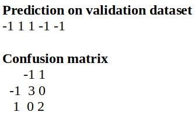

new_df <- data.frame(Height = c(174,184,194,159,157),
                 Weight = c(76,77,50,90,58),
                 Sex = c("Woman",rep("Man",2),rep("Woman",2)))
new_df$Sex <- factor(new_df$Sex)

p <- ggplot(new_df, aes(y = Weight, x = Height, group = Sex)) + 
  geom_point(aes(color = Sex)) +
  scale_color_manual(values = c("#a50026","#006837"))
p + theme_custom()

set.seed(10111)
x = matrix(c(145,155,160,158,174,170,180,185,55,50,52,68,74,86,62,78), 8, 2)
y = rep(c(-1, 1), c(4, 4))

dat = data.frame(x, y = as.factor(y))
dat2 = as.data.frame(scale(data.frame(x),center = TRUE, scale = TRUE))
dat3 = data.frame(Height = dat2$X1, Weight = dat2$X2, y = as.factor(y))
ign <- capture.output({
  svmfit2 <- ksvm(y ~ Weight+Height, data = dat3, kernel = "vanilladot", C = 100)
})

new_x = matrix(c(174,184,194,159,157,76,77,50,90,58), 5, 2)
new_y = c(-1, 1, 1, -1, -1)
new_dat = data.frame(new_x, new_y = as.factor(new_y))
new_dat2 = as.data.frame(scale(data.frame(new_x),center = TRUE, scale = TRUE))
new_dat3 = data.frame(Height = new_dat2$X1, Weight = new_dat2$X2, new_y = as.factor(new_y))

pred <- predict(svmfit2, new_dat3)
```

---
#7. Improving model performance

* Changing the SVM kernel function  

* Changing the SVM cost parameter

---
#8. SVM in practice - Implementing biological application with Python
## Use Case - Problem Statement
Classify the cells based on the features. This image set is of a Transfluor assay where an orphan GPCR is stably integrated into the b-arrestin GFP expressing U2OS cell line.
Channel 1 = FKHR-GFP; Channel 2 = DNA

```{r svm13, echo=FALSE, fig.asp = 0.8, fig.width = 7, out.width="73%", dev='svg'}
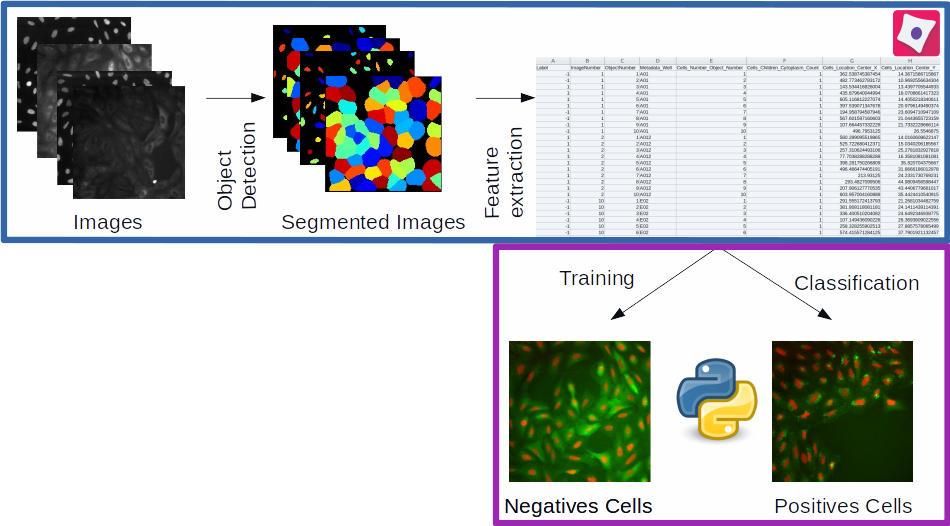
```

---

#8. SVM in practice - Implementing biological application with Python
## Use Case - Translocation Activity
```{r svm14, echo=FALSE, fig.asp = 0.8, fig.width = 7, out.width="90%", dev='svg'}
knitr::include_graphics("./figures/step_by_step.png")
```

---
  
#8. SVM in practice - Implementing biological application with Python
## Use Case - Translocation Activity

```{r svm15, echo=FALSE, fig.asp = 0.8, fig.width = 7, out.width="100%", dev='svg'}
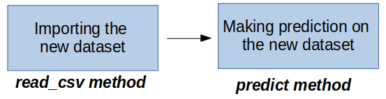
```
---

# Resources

1- Cortes, C., Vapnik, V. Support-vector networks. Mach Learn 20, 273–297 (1995). https://doi.org/10.1007/BF00994018  

2- Bennett, K. and C. Campbell. “Support vector machines: hype or hallelujah?” SIGKDD Explor. 2 (2000): 1-13.  

3- Steinwart, I. and Christmann, A. (2008) Support Vector Machines. Springer-Verlag, New York.  

4- Vapnik, Vladimir. (2000). The Nature of Statistical Learning Theory. 10.1007/978-1-4757-3264-1_1.  

5- Burges, C.. “A Tutorial on Support Vector Machines for Pattern Recognition.” Data Mining and Knowledge Discovery 2 (2004): 121-167.

---

# Summary

1. History of Random Forest

2. Types Of Machine Learning

3. Why Random Forest ?

4. What is Random Forest ?

5. Decision Tree

6. How Does a decision tree work ?

7. How Does a Random Forest work ?

8. Random Forest in practice - Implementing biological application with CellProfiler Analyst    
  a. Use Case - Problem Statement

---
#1. History Of Random Forest

1. *1997*: In an important paper on written character recognition, Amit and Geman define a large number of geometric features and search over a random selection of these for the best split at each node.

--

1. *1998*: Ho has written a number of papers on "the random subspace" method which does a
random selection of a subset of features to use to grow each tree.

--

1. *2001*: The introduction of random forests proper was rst made in a paper by Leo Breiman. This paper describes a method of building a forest of uncorrelated trees using a CART like procedure, combined with randomized node optimization and bagging.


---
#2. Types of Machine Learning

```{r, echo=FALSE, warning=FALSE, message=FALSE, out.width = "100%"}
library(DiagrammeR)
#library(webshot)

#webshot::install_phantomjs()
DiagrammeR::mermaid("
  graph TD
  A{<b>Machine Learning</b>} --> B{<b>Supervised Learning</b>}
  A --> C(<b>Unsupervised Learning</b>)
  A --> D(<b>Reinforcement Learning</b>)
  B --> E[<b>Classification</b>]
  B --> F[<b>Regression</b>]
  E --> G(<b>Random Forest</b>)
  F --> G
  style A fill:#E5E25F
  style B fill:#E5E25F
  style C fill:#87AB51
  style D fill:#87AB51
  style G fill:#87AB51
  style E fill:#B6E6E6
  style F fill:#B6E6E6
")
```

---

#3. Why Random Forest ?

<b>No Overfitting</b>:    
* Number of trees increase
* Training time is less   

<b>High Accuracy</b>:
* Run efficiently on large database

<b>Missing data</b>:
* Accuracy when large proportion of data is missing

---

#4. What is Random Forest ?

<p> Random Forest creates multiple Decision Trees during training phase.    
The Decision of the majority of the trees is chosen by the random forest as the final decision. </p>

```{r, echo=FALSE, fig.asp = 0.8, fig.width = 7, out.width="100%", dev='svg'}
knitr::include_graphics("./figures/what_RF.png")
```

---

#5. Decision Tree

<p>Decision Tree is a tree shaped diagram. Each branch of the tree is an action 
and each node as a result of the decision taken.</p>

```{r, echo=FALSE, fig.asp = 0.8, fig.width = 7, out.width="45%", dev='svg'}
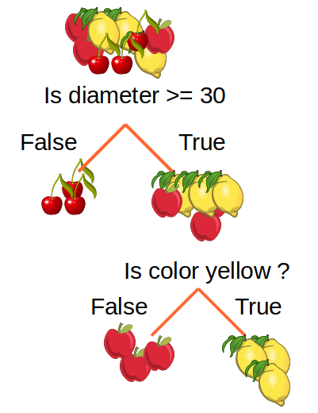
```

---

#5. Decision Tree

```{r, echo=FALSE, fig.asp = 0.8, fig.width = 7, out.width="100%", dev='svg'}
knitr::include_graphics("./figures/DT_2.png")
```

---

#5. Decision Tree

```{r, echo=FALSE, fig.asp = 0.8, fig.width = 7, out.width="100%", dev='svg'}
knitr::include_graphics("./figures/DT_3.png")
```

---

#5. Decision Tree

```{r, echo=FALSE, fig.asp = 0.8, fig.width = 7, out.width="100%", dev='svg'}
knitr::include_graphics("./figures/DT_4.png")
```

---

#5. Decision Tree
## Calculate entropy

$$Entropy = -\sum P(X)log_2P(X)$$ where p(x) is a fraction of a given class   


$$P_L = \frac{3}6 = 0.5$$   


$$P_A = \frac{3}6 = 0.5$$   


$$E_1 = - \sum P_Llog_2(P_L) + P_Alog_2(P_A)$$   
---

#5. Decision Tree
## Calculate entropy

$$P_L = \frac{1}3 = 0.334$$
$$P_A = \frac{2}3 = 0.667$$
$$E_L = - (0.334 log_2(0.334) + 0.667 log_2(0.667)) = -(-0.52+ (-0.38)) = 0.9$$

$$E_R = - (0.334 log_2(0.334) + 0.667 log_2(0.667)) = -(-0.52+ (-0.38)) = 0.9$$

$$E_2 = \frac{C_{ic}}{C_{ip}} * E_L + \frac{C_{ic}}{C_{ip}} * E_R$$
$$E_2 = \frac{3}6 * 0.9 + \frac{3}6 * 0.9 = 0.9$$

---

#5. Decision Tree

```{r, echo=FALSE, fig.asp = 0.8, fig.width = 7, out.width="100%", dev='svg'}
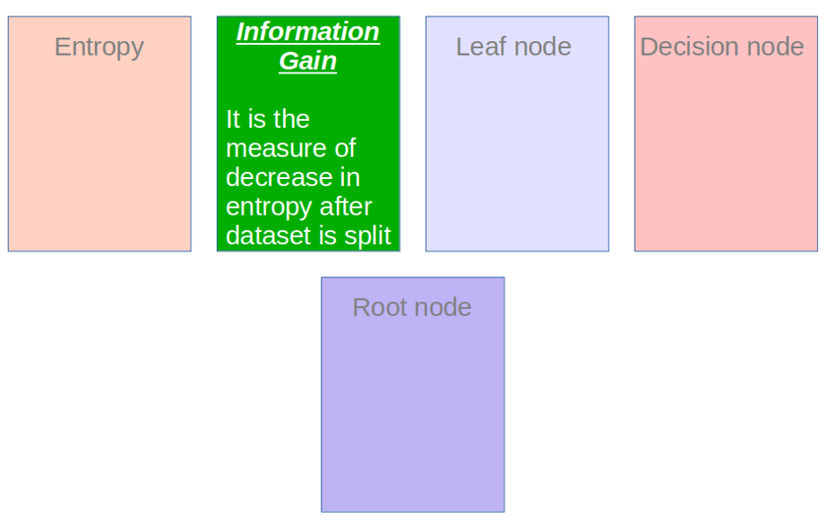
```

---

#5. Decision Tree

```{r, echo=FALSE, fig.asp = 0.8, fig.width = 7, out.width="100%", dev='svg'}
knitr::include_graphics("./figures/DT_6.png")
```

---

#5. Decision Tree
## Information Gain

$$IG = E_1 - E_2 = 1-0.9 = 0.10$$

---

#5. Decision Tree

```{r, echo=FALSE, fig.asp = 0.8, fig.width = 7, out.width="100%", dev='svg'}
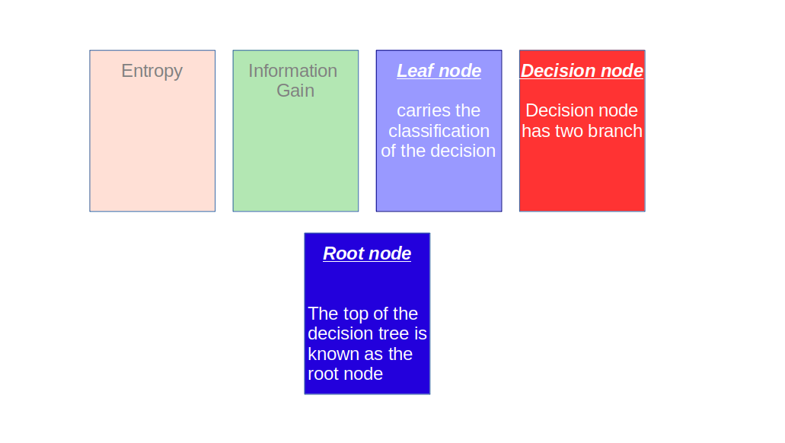
```

---

#5. Decision Tree

```{r, echo=FALSE, fig.asp = 0.8, fig.width = 7, out.width="100%", dev='svg'}
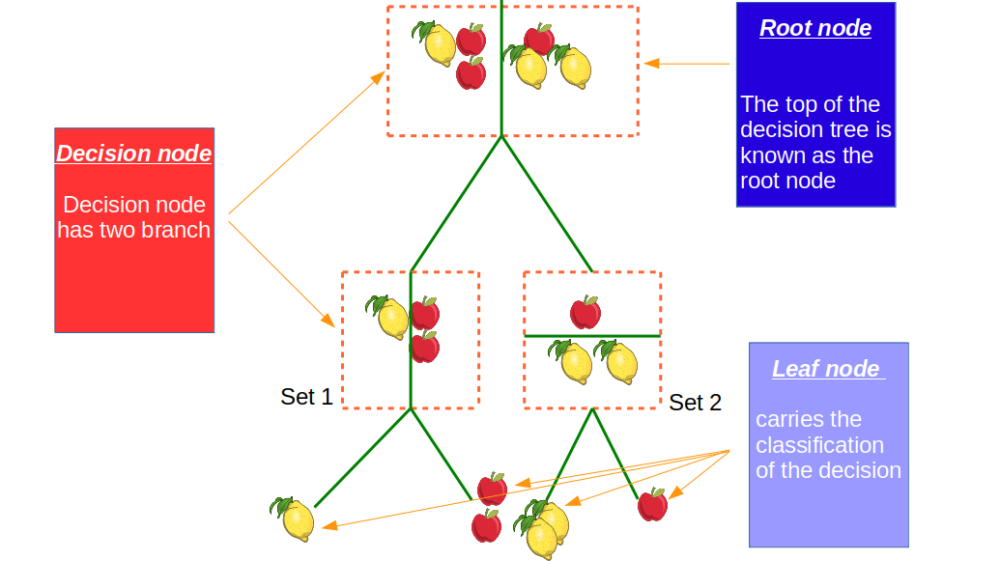
```

---

#6. How Does a decision tree work ?

```{r, echo=FALSE, fig.asp = 0.8, fig.width = 7, out.width="100%", dev='svg'}
knitr::include_graphics("./figures/DT_10.png")
```

---

#6. How Does a decision tree work ?

```{r, echo=FALSE, fig.asp = 0.8, fig.width = 7, out.width="100%", dev='svg'}
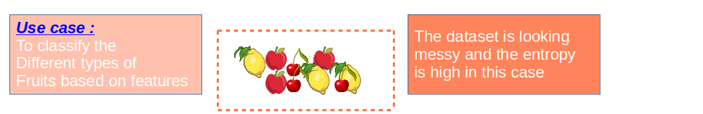
```

---

#6. How Does a decision tree work ?

```{r, echo=FALSE, fig.asp = 0.8, fig.width = 7, out.width="100%", dev='svg'}
knitr::include_graphics("./figures/DT_12.png")
```

---

#6. How Does a decision tree work ?

```{r, echo=FALSE, fig.asp = 0.8, fig.width = 7, out.width="100%", dev='svg'}
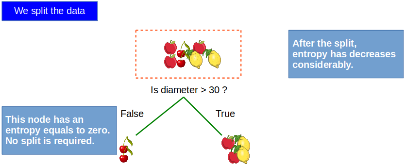
```

---

#6. How Does a decision tree work ?

```{r, echo=FALSE, fig.asp = 0.8, fig.width = 7, out.width="100%", dev='svg'}
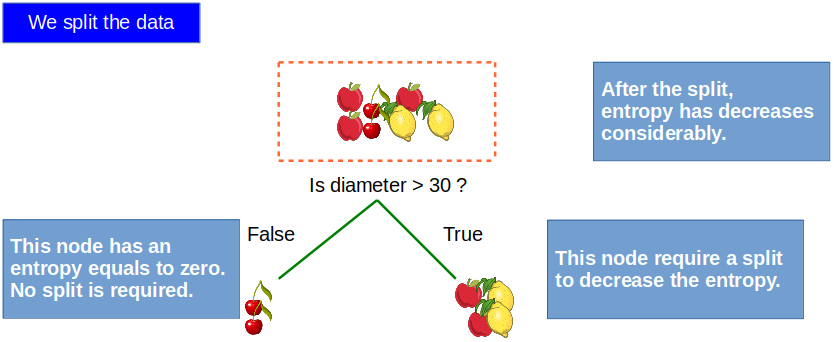
```

---

#6. How Does a decision tree work ?

```{r, echo=FALSE, fig.asp = 0.8, fig.width = 7, out.width="100%", dev='svg'}
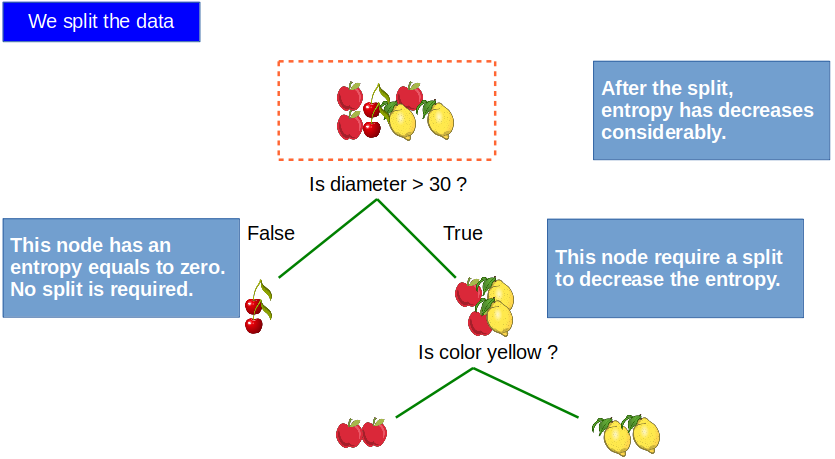
```

---

#7. How Does a random forest work ?

```{r, echo=FALSE, fig.asp = 0.8, fig.width = 7, out.width="100%", dev='svg'}
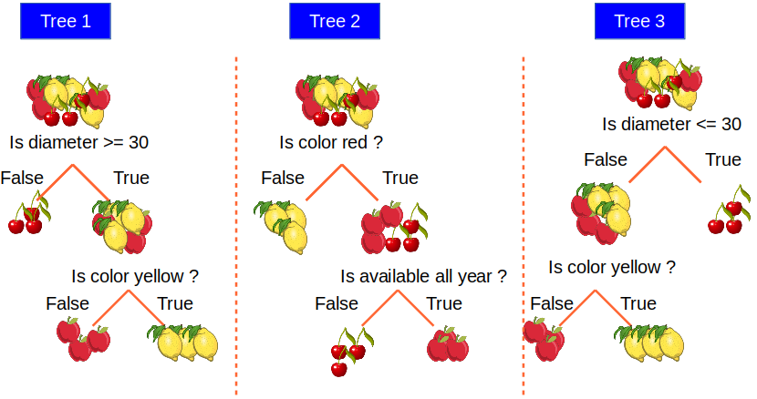
```

---

#7. How Does a random forest work ?

```{r, echo=FALSE, fig.asp = 0.8, fig.width = 7, out.width="100%", dev='svg'}
knitr::include_graphics("./figures/DT_21.png")
```

---

#7. How Does a random forest work ?

```{r, echo=FALSE, fig.asp = 0.8, fig.width = 7, out.width="100%", dev='svg'}
knitr::include_graphics("./figures/DT_24.png")
```

---

#7. How Does a random forest work ?

```{r, echo=FALSE, fig.asp = 0.8, fig.width = 7, out.width="100%", dev='svg'}
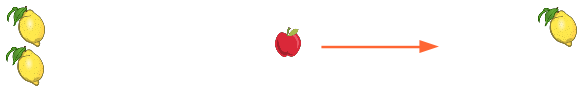
```

---

##8. RF in practice - Implementing biological application with CellProfiler Analyst
### Use Case - Problem Statement
Estimate the lowest dose necessary to induce the cytoplasm to nucleus translocation of the
transcription factor NFkB in A549 (human alveolar basal epithelial) cells in response to $TNF\alpha$ concentration. Channel 1 = FITC; Channel 2 = DAPI.

```{r, echo=FALSE, fig.asp = 0.8, fig.width = 7, out.width="75%", dev='svg'}
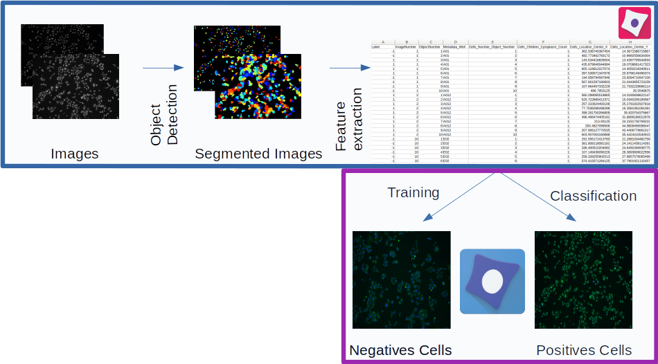
```

---

# Resources

1- Mingers, J. An empirical comparison of selection measures for decision-tree induction. Mach Learn 3, 319–342 (1989). https://doi.org/10.1007/BF00116837  

2- F. Esposito, D. Malerba, G. Semeraro and J. Kay, "A comparative analysis of methods for pruning decision trees," in IEEE Transactions on Pattern Analysis and Machine Intelligence, vol. 19, no. 5, pp. 476-491, May 1997, doi: 10.1109/34.589207.

3- Robert E. Schapire and Yoav Freund. 2012. Boosting: Foundations and Algorithms. The MIT Press.  

4- Breiman, L. Bagging predictors. Mach Learn 24, 123–140 (1996). https://doi.org/10.1007/BF00058655.  

5- Breiman, L. Random Forests. Machine Learning 45, 5–32 (2001). https://doi.org/10.1023/A:1010933404324.