## Machine Learning for  Bio-Image-Analysis

10.05.2021

Volker Bäcker, Jean-Bernard Fiche,  Cedric Hassen Khodja, Francesco Pedaci

***

### Introduction

- What is bio-image analysis?

- How is it done without machine  
learning?

- What is machine learning?

- How is bio-image analysis done  
with machine learning?

***
<section>
### Bio-Image-Analysis

“The extraction of information from digital images in the context of biological research”

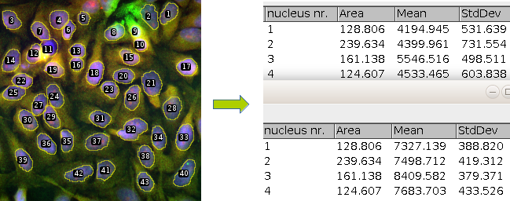

***

#### The Image-Analysis Workflow

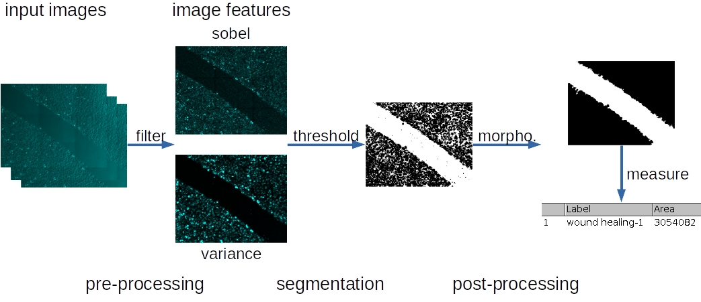

***

#### Select a scale
<small>

- Use “Gaussian blur”-filter to select a scale
    - Low-pass filter
    - Removes high frequencies from the image
        - The higher sigma, the lower the remaining frequencies

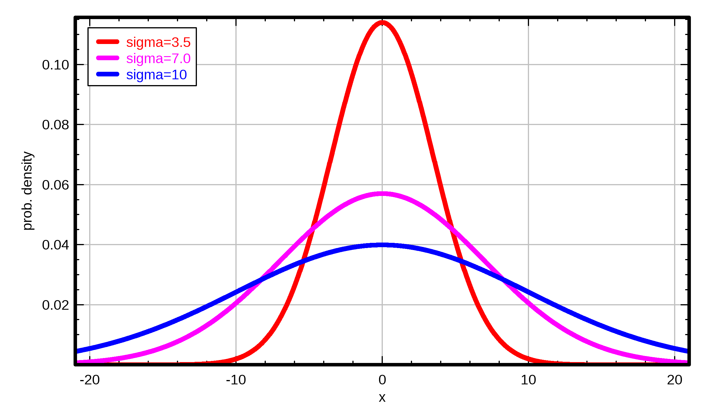

</small>

***

### Convolution

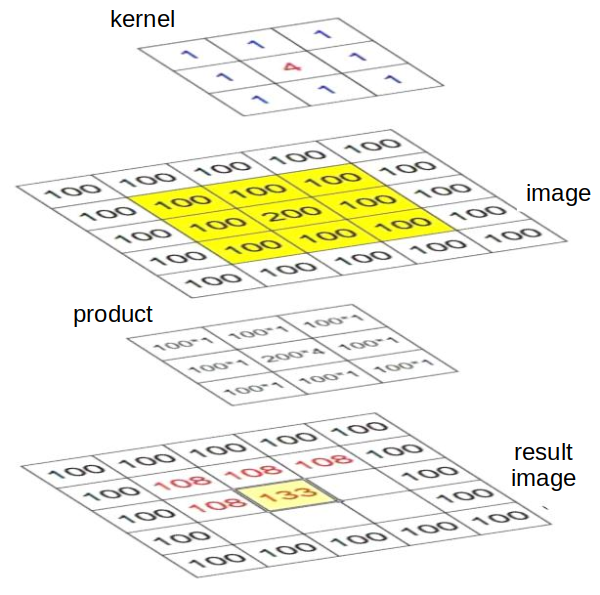

***

#### Features at different scales

<table>
<tr style="align: center">
<th  style="text-align: center; vertical-align: middle;">feature</th>
<th style="text-align: center; vertical-align: middle;">σ=3.5</th>
<th style="text-align: center; vertical-align: middle;">σ=7.0</th>
<th style="text-align: center; vertical-align: middle;">σ=10.</th>
</tr>
<tr>
<td  style="text-align: center; vertical-align: middle;">variance</td><td>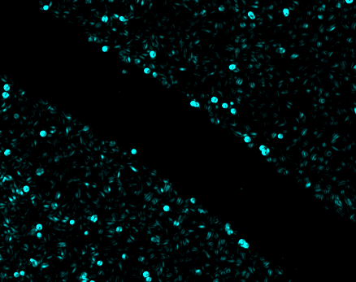</td><td></td><td>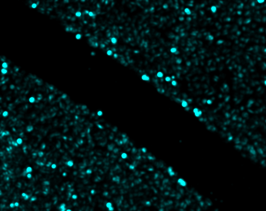</td>
</tr>
<tr>
<td  style="text-align: center; vertical-align: middle;">sobel</td><td></td><td>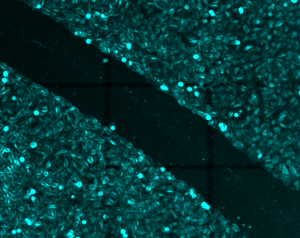</td><td></td>
</tr>
</table>

</section>

***

<section>

### Machine Learning

Machine learning algorithms build a mathematical model of sample data, known as ”training data”, in order to make predictions or decisions without being explicitly programmed to perform the task.

***

#### Machine Learning phases

-  training
    - a model is learned from training data

 

- validation
    - the trained model is validated  against test data

- application
    - use the trained model to  make predictions on new data

***

#### Machine Learning vocabulary

<small>
<table>
<tr><td>

</td>
<td>
- supervised
    - a model is learned from pairs of input and output data
</td>
<td></td>
<td>
- unsupervised
    - a model is learned from the inherent structure of the input data alone
</td></tr>
<tr><td></td><td>
- classification
    - the result is a category 
</td><td></td><td>
- regression
    - the result is a real number
</td></tr>
</table>
</small>

***

#### Machine Learning -  How is that even possible?

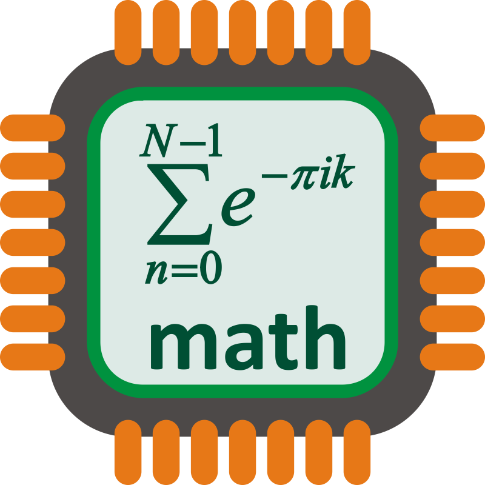

- ML algorithm implements a  mathematical model with a number  of model parameters

- given the training data,  find parameter values that minimize  the prediction error

***

#### Machine Learning Example 1   Linear Regression

<small>
Training Data:

| Femur length (cm) | Height (cm) |
|-------------------|-------------|
| 45                | 153         |
| 44                | 168         |
| 44                | 177         |
| 47                | 180         |
| 44                | 171         |
| 50                | 168         |

</small>

estimate body height f(x) given the femur length x.

model: f(x) = &omega;1 + &omega;2 &times; x

parameter of the model:  &nbsp;&omega;1 and &omega;2

***

#### Machine Learning Example 1   Linear Regression

<small>

- find parameters  ω1, ω2 

- so that error  between  training data  and model  is minimal 

</small>

***

#### Example 1 - Squared Loss function

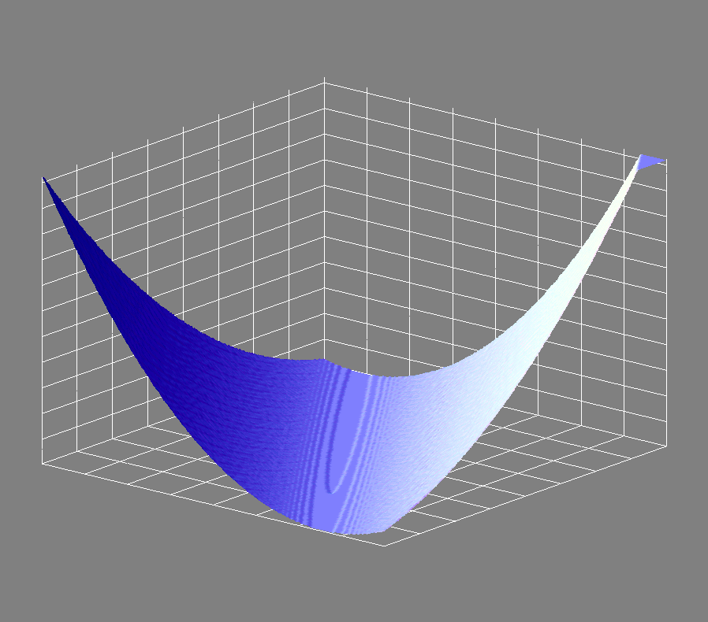

***

#### Example 1 - Gradient descent

- find the minimum of  the loss function

- by using gradient  descent

***

#### Example 1 - Predictions

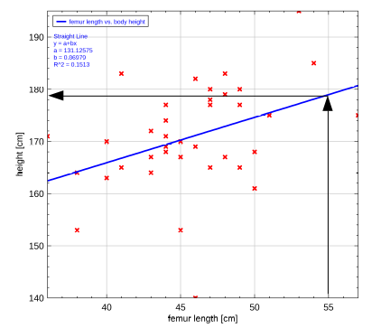

f(x) = &omega;1 + &omega;2 &times; x 

&omega;1 = 131.13cm

&omega;2 = 0.87

f(55cm) = 131.13cm + 0.87 &times; 55cm

f(55cm) = 179.42cm

***

#### Femur example

- Supervised or Unsupervised?

- Classification or Regression?

</section>

***

### The programs

- ImageJ/FIJI 

- Weka / Labkit

- Ilastik

- Cellprofiler / CP Analyst

- Orbit

***

<section>

### ImageJ/FIJI

- Demo ImageJ 01
    - Open Image
    - Threshold
    - Binary Watershed
    - Compare to GT

***

### ImageJ/FIJI

- Demo ImageJ 02
    - Revert Image
    - Laplacian of Gaussian (scale 3)
    - Threshold (Yen)
    - Binary Watershed
    - Compare to GT

***

### Ilastik

- Demo Ilastik
    - import image(s)
    - select features and scales
    - name classes
    - select training data
    - export result
    - batch

***

### Exercises 01

</section>

***

<section>

### Clustering

- A machine learning method

    - Unsupervised
    
    -  Classification

***

### Clustering

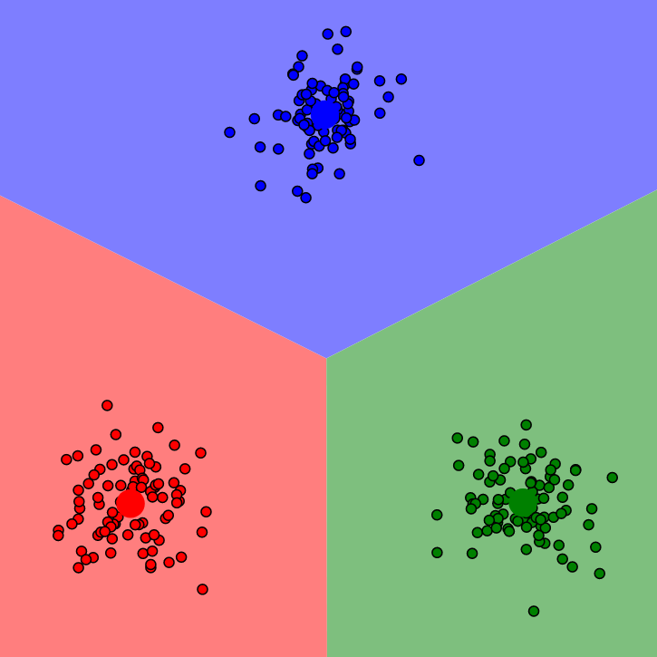

- Clustering 

    - Group objects in a way that 

        - objects in the same cluster are  more similar to each other

        - than to objects in other clusters

***

### Clustering algorithms

- K-means
- DBScan
- hierarchical clustering
- expectation-maximization 
- ...

***

### k-means clustering

- Algorithm:
    - Start with k initial means
    - Repeat until convergence
        - Assign feature-vectors to clusters
        - Recalculate the means of the clusters

- Partition the feature- space into k-clusters

- Each feature-vector  belongs to the cluster  with nearest mean

***

### K-means example

***

### K-means clustering in  machine learning

- Classification of unknown data:

    - calculate the feature vector

    - assign it to the cluster  with the nearest mean

- Training phase:

    - randomly select a number of  feature vectors

        - for example 5% of the data	

    - run the k-means clustering on  the selected feature vectors

    - the resulting means are the  classifier

***

### Classify pixels by color

- RGB

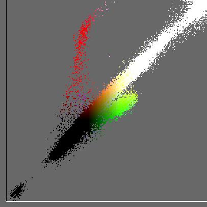

- input image

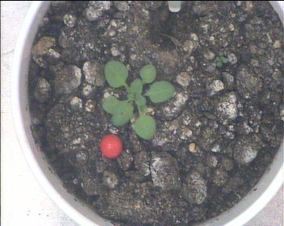

***

### CIEL\*a\*b\* color-space

- CIEL*a*b* color-space
    - L = lightness
    - a = green (-) to red (+)
    - b = yellow (-) to blue (+)
 
 
- Designed, so that 
    - distances correspond to perceived  distances between colors.

***

### Software

- color clustering in FIJI
- comes with WEKA
- Plugins>Segmentation>Color Clustering

***

### Exercises 02

</section>